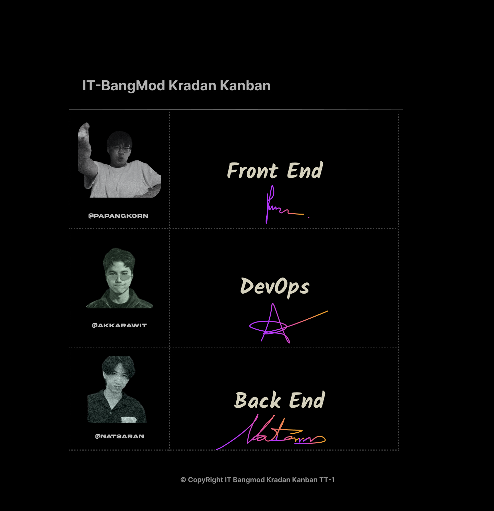
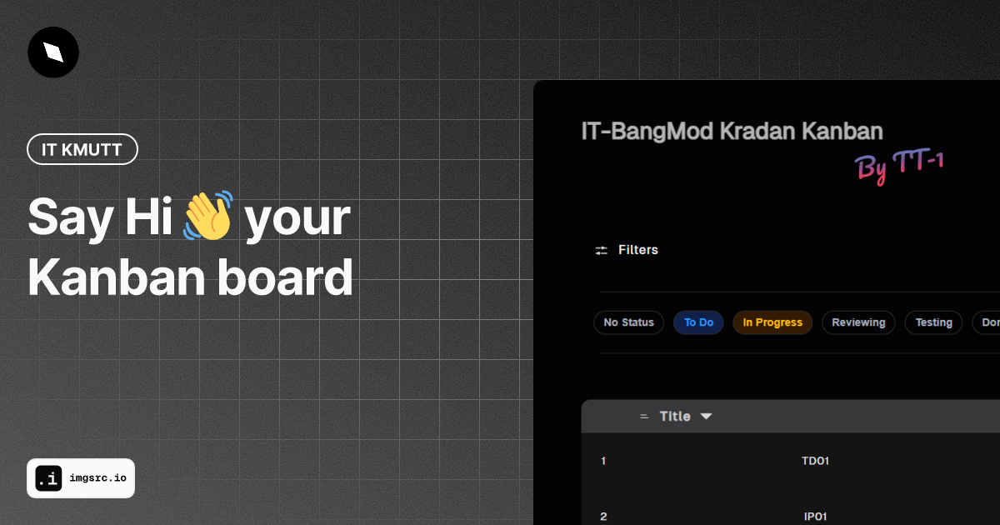

# INT221_Frontend-Kanban

##### This project is the part of integrated project of IT KMUTT.


<div align="center">

</div>

<div align="center">

</div>
<div align="center">

</div>

[See design system](https://www.figma.com/design/PBECxmprRuOT3Goo6uceJt/Design?node-id=0-1&t=NjntetTKDm2LaAEI-1)

## Project Setup

```sh
npm install
```

### Compile and Hot-Reload for Development

```sh
npm run dev
```

### Compile and Minify for Production

```sh
npm run build
```
